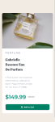

# Frontend Mentor - Product preview card component solution

This is a solution to the [Product preview card component challenge on Frontend Mentor](https://www.frontendmentor.io/challenges/product-preview-card-component-GO7UmttRfa). Frontend Mentor challenges help you improve your coding skills by building realistic projects. 


### The challenge

Users should be able to:

- View the optimal layout depending on their device's screen size
- See hover and focus states for interactive elements

## Screenshots

### Mobile
     

### Desktop
  

### Links

- Solution URL: [Add solution URL here](https://your-solution-url.com)
- Live Site URL: [Add live site URL here](https://your-live-site-url.com)

## My process

### Built with

- Semantic HTML5 markup
- CSS custom properties
- Flexbox
- CSS Grid
- Mobile-first workflow

### What I learned
In my previous project i didn't understand Responsive image handling quite well but In this project, I learned/practiced it:

 Responsive image handling:
```html
<picture>
  <source media="(min-width: 768px)" srcset="images/image-product-desktop.jpg">
  
</picture>
 I also learned flexbox for centering as well as CSS custom properties for theming
 -:root {
  --dark-cyan: hsl(158, 36%, 37%);
  --cream: hsl(30, 38%, 92%);
}
-.card {
  display: flex;
  align-items: center;
  justify-content: center;
}
### Continued development

I would like to focus more on More efficient responsive design techniques and Better accessibility practices for my future projects.

### Useful resources

## Author

- Website - [Add your name here](https://www.your-site.com)
- Frontend Mentor - [@yourusername](https://www.frontendmentor.io/profile/yourusername)


## Acknowledgments

